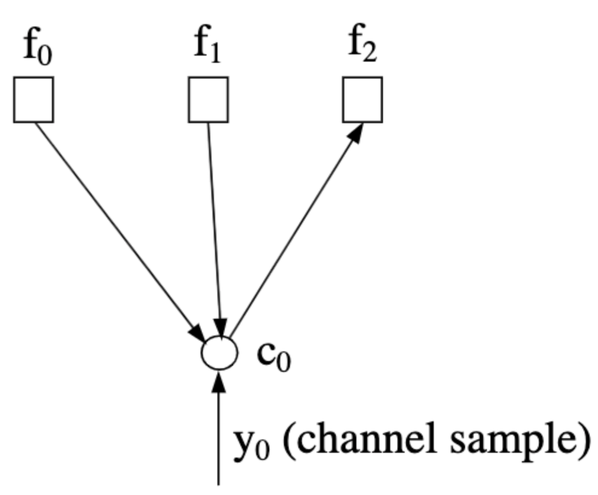
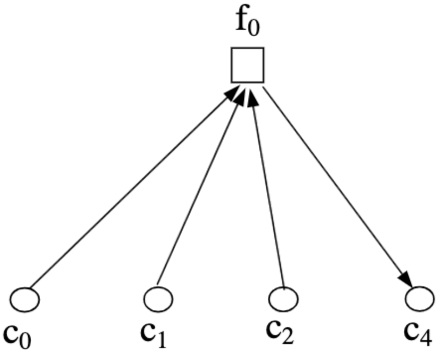

# {{ page.title }}

This page describes the concept of belief propagation and message passing 
{: .fs-6 .fw-300 }

Decoding algorithms for LDPC codes generally derive from the belief propagation (BP) algorithm which is also termed the 
sum-product (SP) or message passing (MP) algorithm. The algorithm is a probabilistic algorithm which considers the 
posterior probabilities of bits ($c_i$) given channel observations $\mathbf{y}$. The algorithm may be phrased in terms
of probability:

$$
\Pr\left(c_i=1\vert \mathbf{y}\right)
$$

in terms of likelihood ratio:

$$
l(c_i)=\frac{\Pr(c_i=0\vert \mathbf{y})}{\Pr(c_i=1\vert \mathbf{y})}
$$

or in terms of the log-likelihood ratio:

$$
L(c_i)=\log\left(\frac{\Pr(c_i=0\vert \mathbf{y})}{\Pr(c_i=1\vert \mathbf{y})}\right)
$$

---

# Message Passing
The algorithm is an iterative algorithm which conceptually “passes messages” between nearest neighbor nodes of a Tanner
graph. Each node passes only **extrinsic** information, i.e. each node processes all relevant information gathered from 
other nodes and possibly the channel sample, but when passing a message to a specific node, it uses information only 
from **other** nodes. Recalling the [Tanner graph](./representation.md#tanner-graph) representation of the code, 
messages can either be passed from variable nods to check nodes or the other way around.

## Passing Up
Message passing from variable to check nodes is referred to as passing *up* (denoted $m_{\uparrow ij}$). The information
passed considers the probability $\Pr(c_i=b\vert \text{input messages})$. Assuming a Tanner graph corresponding to an 
$H$ whose zeroth column is $\left[1,1,1,0,\dots,0\right]^T$, the message $m_{\uparrow 02}$ is shown below. Note the 
direction of the arrows, which indicate the inputs used by node $c_0$ to formulate the message.


|  |
|:--:|
| Image taken from [{{ bib_author[0].name }}]({{bib_author[0].url}})|

## Passing Down
Message passing from check to variable nodes is referred to as passing *down* (denoted $m_{\downarrow ji}$). The 
information passed considers the probability $\Pr(f_j\text{ is satisfied}\vert \text{input messages})$. Assuming a 
Tanner graph corresponding to an $H$ whose zeroth row is $\left[1,1,1,0,1,,0\dots,0\right]^T$, the message 
$m_{\downarrow 04}$ is shown below. Note the direction of the arrows, which indicate the inputs used by node $f_0$ to 
formulate the message.

|  |
|:--:|
| Image taken from [{{ bib_author[0].name }}]({{bib_author[0].url}})|

---

# Algorithm Concept
The algorithm goes along the following concept:
 - Each iterative step is divided to two half steps:
   - First, all variable nodes pass messages to check nodes.
   - Then, all check nodes passes messages to variable nodes.
 - Iterations are done until a stop criteria, or a predetermined threshold.
 - After iterations are done, bit values $c_i$ are estimated to form decoding decision.

The algorithm assumes messages are statistically independent. This assumption doesn't hold if channel samples $y_i$ 
aren't independent (which is possible). Even if samples are independent, the messages aren't if the graph contains 
cycles (for girth $\gamma$, independence holds for $\gamma/2$ iterations). Nonetheless, even though the assumptions 
aren't adhered, simulation showed performance can still be good if short cycles are avoided.