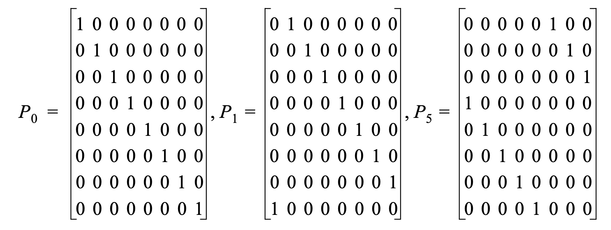
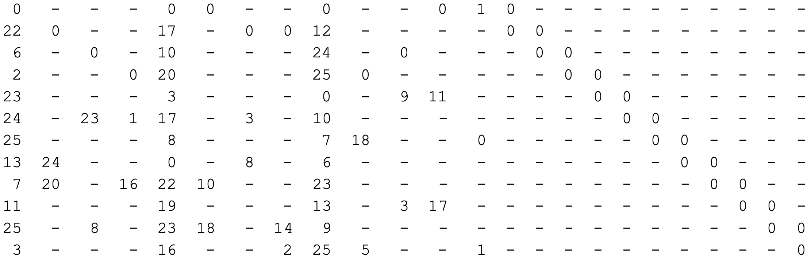

The standard introduced codes with three possible block lengths ($n$) of sizes : 648, 1296, or 1944 bits long. 
Additionally, for each block length four rate are supported: 1/2, 2/3, 3/4, or 5/6.

The codes used in the standard have parity check matrices which are divided into sub-blocks. Each sub-block is of size 
$Z\times Z$, where $Z$ depends on $n$. Each sub-block is an all zeros matrix, an identity matrix or a cyclic 
permutation matrix $P_i$ obtained from the $Z\times Z$ identity matrix by cyclically shifting the columns to the right 
 $i$ times. Examples of cyclic-permutation matrices with $Z=8$.


|  |
|:--:|
| Taken from [{{ ieee[0].name }}]({{ieee[0].url}})|

The actual parity check matrices used, appear in the standard in block form. For instance for block length of $n=648$
bits and rate $r=1/2$, uses $Z=27$ and the parity check matrix shown below:

|  |
|:--:|
| Parity check matrix for $n=648$ bits and rate $r=1/2$, taken from [{{ ieee[0].name }}]({{ieee[0].url}})|

Above, dashes indicate all zero sub-blocks, and numbers indicate the amount of shifts per sub-block. Values of $0$ 
indicate identity matrices. The observed format of double diagonal on the far right is shared among all codes in the 
standard and enables efficient encoding.