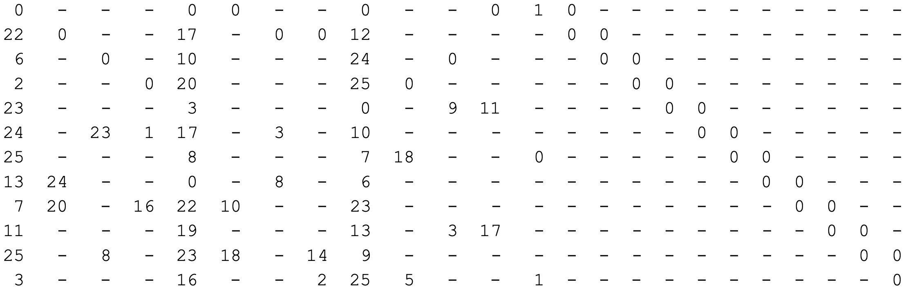



The described algorithm is taken from  [{{cai[0].name}}]({{cai[0].url}}). The form of the parity check matrices enables
an efficient encoding scheme. Consider the parity check matrix shown before in block form:


|  |
|:--:|
| Parity check matrix for $n=648$ bits and rate $r=1/2$, taken from [{{ ieee[0].name }}]({{ieee[0].url}})|

Above, dashes indicate all zero sub-blocks, and numbers indicate the amount of shifts per sub-block. Values of $0$ 
indicate identity matrices. The observed format of double diagonal on the far right is shared among all codes in the 
standard and enables efficient encoding. Specifically, all the matrices for codes in the standard share the following 
structure. For a block matrix of dimensions $m_b\times n_b$ there are varying structures for the first $k_b$ columns. 
*However, the $k_b$-th column always has **exactly three non-zero blocks, two blocks labeled as $1$ in the top and 
bottom row, and one identity row** labeled as the $x$-th row.* To the right of the $k_b$-th column, there are $m_{b}-1$
columns which exhibit the shown double diagonal form.

Let us denote the input information sequence as $m$ and divide it into $k_b= n_b-m_b$ groups of $Z$ bits, i.e. 
$m=[m_0, m_1, \dots, m_{k_b-1}]$, where each element of $m$ is itself a vector of length $Z$. The parity sequence can 
also be grouped as length of $Z$ bits and expressed as: $p=[p_0, p_1, \dots, p_{m_b-1}]$. correspondingly, codewords
may be expressed as: 

$$c=[m, p]=[m_0, m_1, \dots, m_{k_b-1},p_0, p_1, \dots, p_{m_b-1}]$$

Since every valid codeword must adhere to: $Hc^T=0$, the equation may be expanded as:

|  |
|:--:|
| Taken from [{{ cai[0].name }}]({{cai[0].url}})|

The latter may be divided into a set of four types of equations. The top, bottom and $x$-th row are special, and an 
equation for all the rest. These can be expressed as:

$$
\begin{align}
&\sum_{j=0}^{k_b-1} h_{0,j}m_j + \Pi_1p_0+ p_1=0,\;\;\;\;(0th\; row)\\
&\sum_{j=0}^{k_b-1} h_{i,j}m_j + p_i + p_{i+1}=0,\;\;\;\;(i\neq 0,x,m_b-1)\\
&\sum_{j=0}^{k_b-1} h_{x,j}m_j + p_0 + p_x + p_{x+1}=0,\;\;\;\;(xth\; row)\\
&\sum_{j=0}^{k_b-1} h_{m_b-1,j}m_j + \Pi_1p_0+ p_{m_b-1}=0,\;\;\;\;(m_b-1\; row)\\
\end{align}
$$

where $\Pi_1$ is the identity matrix shifter one column to the right. In the above all equalities must be interpreted as
with summation modulo 2. To simplify the above, the four equations may be summed to obtain:

$$
p_0=\sum_{i=0}^{m_b-1} \sum_{j=0}^{k_b-1} h_{i,j}m_j = \sum_{i=0}^{m_b-1}\lambda_i = 0
$$

with $\lambda_i= \sum_{j=0}^{k_b-1} h_{i,j}m_j$. With $p_0$ in hand and using top and bottom equations:

$$
\begin{align}
&p_1=\lambda_0+\Pi_1p_0\\
&p_{m_b-1}=\lambda_{m_b-1} + \Pi_1p_0
\end{align}
$$

With these, by using equations for the $i$-th and $x$-th row, all other parities can be found recursively.
Actually, this can even be made simpler! Due to the form of the matrices $h_{i,j}$, the multiplications $h_{i,j}m_j$ 
reduce circular shifts of the vectors $m_j$! Thus, encoding reduces to summation of circular shifts of message bits. 
Moreover, to avoid recomputing $\lambda_i$, given a message sequence all $m_b$ $\lambda_i$'s may be computed and stored
in memory (each of them is a vector of $Z$ bits), and the recursive algorithm then needs only to sum them once to obtain
$p_0$, and then use each of them once more during the computation.

This algorithm has been implemented in the repo.