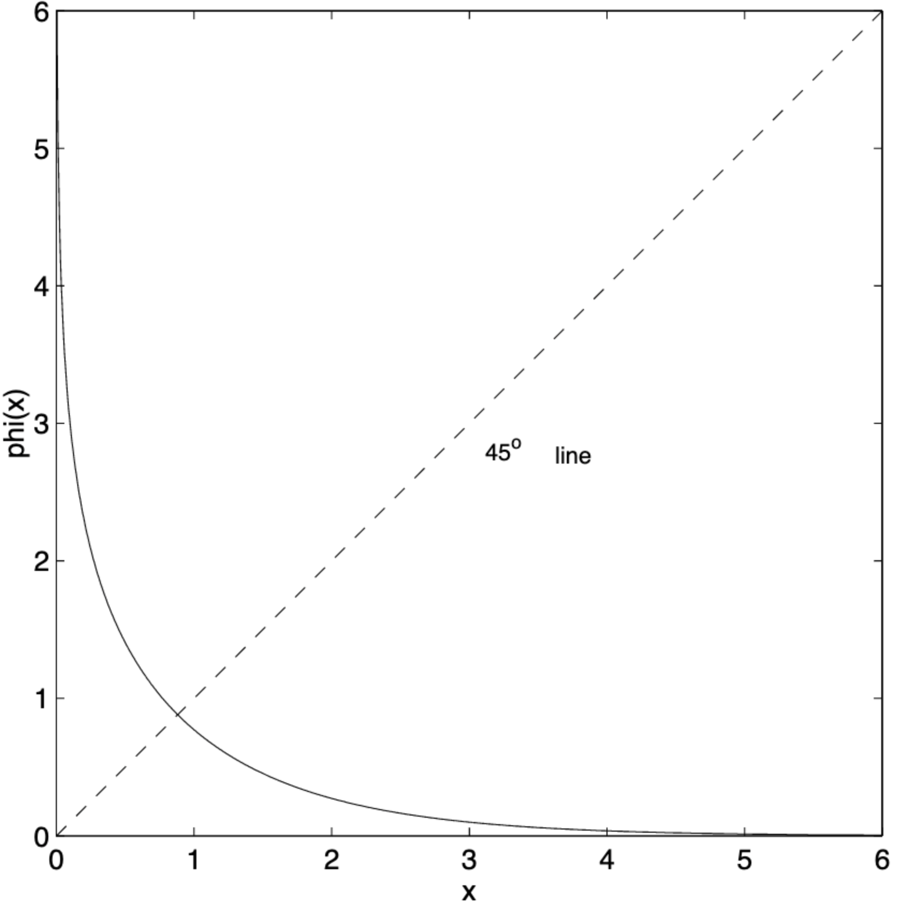

# {{ page.title }}

This page describes the sum-product algorithm in the log-likelihood domain
{: .fs-6 .fw-300 }
---

Outline of this page:
 1. Motivation
 2. Definitions
 3. Channel models
 4. Update rules
 5. Outlining the algorithm
 6. Discussion

---
# Motivation

The [probability domain](probability_spa.md) version of the algorithm, involves many multiplications. This may be costly
in terms of computation for hardware implementation. It may also introduce numerical instabilities (multiplication by 
zero). As such, a version which involves additions is preferred.

---
# Definitions

Define log-likelihood ratios (LLR):
 - $L(c_i )=\log\left(\frac{\Pr(c_i=0\vert y_i )}{Pr(c_i=1\vert y_i ) }\right)$
 - $L(r_{ji}) = \log\left(\frac{r_{ji}(0)}{r_{ji}(1)}\right)$
 - $L(q_{ij}) = \log\left(\frac{q_{ij}(0)}{q_{ij}(1)}\right)$
 - $L(Q_i)=\log\left(\frac{Q_i(0)}{Q_i(1)}\right)$

For the LLR version of the algorithm, the messages passed are:

$$m_{\uparrow ij}=L(q_{ij})$$

and

$$m_{\downarrow ji}=L(r_{ji} )$$

---
# Channel Models

The channel dependency is also transformed to log domain.
 - BEC – channel samples are $y_i\in\\{0,1,E\\}$, for which:

$$L(c_i)=\begin{cases}
+\infty &	y_i=b	\\
-\infty	&	y_i=b^c	\\
0	&	y_i=E
\end{cases}$$
 
 - BSC – with error probability $\epsilon$, channel samples are $y_i\in\\{0,1\\}$, for which:

$$L(c_i )=(-1)^{y_i} \log\left(\frac{1-\epsilon}{\epsilon}\right)$$

 - BI-AWGNC (binary input AWGN channel). Channel inputs are $x_i=1-2c_i$, and channel samples are $y_i=x_i+n$, where 
$n\sim N(0,\sigma^2 )$, for which:

$$L(c_i) = \frac{2y_i}{\sigma^2}$$

---

# Update Rules

Following [{{ bib_author[0].name }}]({{bib_author[0].url}}) (p.13-14), we get the following update rules:
 - $L(r_{ji})$ - Define $L(q_{ij})=\alpha_{ij} \beta_{ij}$, where $\alpha_{ij}=sign(L(q_{ij}))$, and $\beta_{ij}=\vert L(q_{ij})\vert$. Then:

$$L(r_{ji})=\prod_{i'\in V_j/i}\alpha_{i'j}
\phi\left(\sum_{i'\in V_j/i}\phi()\beta_{i'j}\right)$$

where: $\phi(x)=-\log{\left[\tanh{\left(\frac{x}{2}\right)}\right]}=\log{\left(\frac{e^x+1}{e^x-1}\right)}$

- $L(q_{ij})$ - Using the above, we may do:

$$
L(q_{ij}) = L(c_i) + \sum_{j'\in C_i/j}L(r_{j'i})
$$

- $L(Q_i)$ - Similarly we may do:

$$
L(Q_i) = L(c_i) + \sum_{j\in C_i}L(r_{ji})
$$

---

# Algorithm
 1. For $n$ bits initialize: $L(q_{ij})=L(c_i )$, for all $i,j$ for which $h_{ij}=1$
 2. Update $L(r_{ji})$
 3. Update $L(q_{ij})$
 4. Update $L(Q_i )$
 5. For all $n$ bits decode $\hat{c}_i=\begin{cases}1 & L(Q_i)<0\\0 & \text{else}\end{cases}$
 6. If $H\hat{c}^T=0$ or exceeded maximal iterations limit, stop, else go to step 2.

---

# Discussion
 - The complicated function $\phi(x)$ is rather well-behaved for $x>0$ (see figure below) and can be implemented using a 
lookup table.
 - Reduced complexity versions of this decoder exist where the product can be eliminated altogether subject to some 
approximations.

|  
|:--:|
| Image taken from [{{ bib_author[0].name }}]({{bib_author[0].url}})|