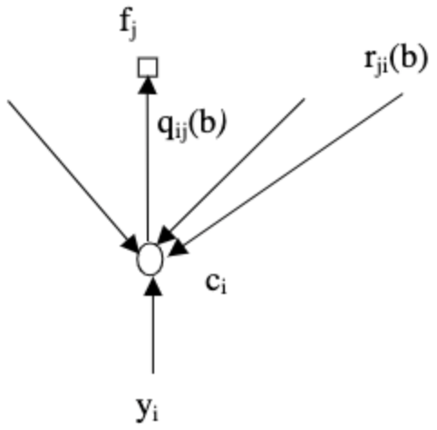
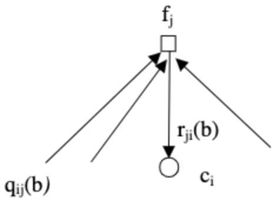

# {{ page.title }}

This page describes the sum-product algorithm in the probability domain
{: .fs-6 .fw-300 }
---
Outline of this page:
 1. Definitions
 2. Factorization of complicated expressions into simpler ones
 3. Discussion of channel models and how they come into play in LDPC codes
 4. Outlining the algorithm
 5. Discussion

---
# Definitions
We begin with a set of definitions:
 - $V_j$ - set of v-nodes connected to c-node $f_j$.
 - $V_j/i$ - set of v-nodes connected to c-node $f_j$, *except* v-node $c_i$.
 - $C_i$ - set of c-nodes connected to v-node $c_j$.
 - $C_i/j$ - set of c-nodes connected to v-node $c_i$, *except* c-node $f_j$. 
 - $M_v (\sim i)$ - set of messages from all v-nodes except node $c_i$.
 - $M_c (\sim j)$ - set of messages from all c-nodes except node $f_j$.
 - $P_i=\Pr(c_i=1\vert y_i )$, where $y_i$ is the channel input (channel model dependent).
 - $S_i$ - the event that parity check equations involving node $c_i$ are satisfied.
 - $q_{ij} (b)=\Pr(c_i=b\vert S_i,y_i,M_c(\sim j))$ - with $b\in\\{0,1\\}$. For probability domain algorithm we get 
$m_{\uparrow ij}=q_ij (b)$.
 - $r_{ji}(b)=\Pr(\text{check equation } f_j \text{ is satisfied}\vert c_i=b,M_v (\sim i))$ - with $b\in\\{0,1\\}$. For 
probability domain algorithm we get  $m_{\downarrow ji}=r_{ji}(b)$.

Note that the listed probabilities are in fact random variables as they are functions of the random channel samples 
$y_i$. As shown in the figure below, for the probability domain algorithm, $q_{ij}$ are the messages passed from v-nodes
to c-nodes, while $r_{ji}$ are the messages passed from c-nodes to v-nodes.


|  |  |
|:--|:--|
| Image taken from [{{ bib_author[0].name }}]({{bib_author[0].url}})|

# Factorizing $q_{ij}(b)$
Due Bayes rule and assumed independence we may factorize (see [{{ bib_author[0].name }}]({{bib_author[0].url}}) for 
details):

$$q_{ij} (0)=\Pr(c_i=0\vert S_i,y_i,M_c (\sim j))=K_{ij} (1-P_i)\prod_{j'\in c_i/j}r_{j'i} (0)$$

and similarly:

$$q_{ij} (1)=K_{ij}P_i\prod_{j'\in c_i/j}r_{j'i} (1)$$

where $K_{ij}$ are chosen such that $q_{ij}(0) + q_{ij}(1) = 1$. Note that the products involve all check nodes $j'$
which have edges connecting to variable node $i$, *except* for check node $j$, as required previously when we dictated 
that the algorithm passes only *extrinsic* information.

# Factorizing $r_{ji}(b)$
Note the following observation made by Gallager.Consider a sequence of $M$ independent bits $a_i$, for which 
$\Pr(a_i=1)=p_i$. Then the probability of having an *even* number of 1’s is:

$$
\frac{1}{2}+\frac{1}{2}\prod_{i=1}^M (1-2p_i )
$$

which can be found by induction on $M$. Now, in order to satisfy any parity check equation $f_j$ over a **binary** 
alphabet, it must contain an even number of 1's. Thus, by mapping $p_i\to q_{ij}(1)$ and conditioning on $c_i=0$ (so 
that all other bit must have an even number of 1's), we get from definition:

$$r_{ji}(0) = \frac{1}{2}+\frac{1}{2}\prod_ {i'\in V_j/i}(1-2q_{i'j}(1))$$

By normalization:

$$r_{ji}(1) = 1- r_{ji}(0)$$

# Channel Models
So far the derivation was channel independent. However, the messages depend on $P_i=\Pr(c_i=1\vert y_i )$ which is 
clearly channel dependent. As an example we consider three channels:

 - BEC – channel samples are $y_i\in\\{0,1,E\\}$, for which:

$$\Pr(c_i=b\vert y_i )=\begin{cases}
1 & y_i=b \\
0 & y_i=b^c \\
1/2 & y_i=E
\end{cases}$$

 - BSC – with error probability $\epsilon$, channel samples are $y_i\in\\{0,1\\}$, for which:

$$\Pr(c_i=b\vert y_i )=\begin{cases}
 1-\epsilon & y_i=b \\
 \epsilon & y_i=b^c
 \end{cases}$$

 - BI-AWGNC (binary input AWGN channel). Channel inputs are $x_i=1-2c_i$, and channel samples are $y_i=x_i+n$, where 
$n\sim N(0,\sigma^2 )$, for which:

$$ \Pr(x_i=x \vert y_i) = [1+\exp(-2yx/\sigma^2)]^{-1} $$

---

# Algorithm
 1. For $n$ bits set $P_i=\Pr(c_i=1\vert y_i )$, then initialize: $q_{ij}(0)=1-P_i$ and $q_{ij}(1)=P_i$, for all $i,j$ 
for which $h_{ij}=1$.
 2. Update $r_{ji}(b)$ using $q_{ij}(b)$.
 3. Update $q_{ij}(b)$ using $r_{ji}(b)$, and normalize by setting $K_{ij}$.
 4. For all $n$ bits compute the following: $Q_i (1)=K_i P_i \prod_{j\in C_i}r_{ji} (1)$, and $Q_i (0)=K_i (1-P_i ) 
\prod_{j\in C_i}r_{ji}(1)$. Note that no nodes are omitted here. Set $K_i$ such that $Q_i (1)+Q_i (0)=1$.
 5. For all $n$ bits decode $$\hat{c}_i=\begin{cases}1 & Q_i(1)>Q_i(0)\\0 & \text{else}\end{cases}$$
 6. If $H\hat{c}^T=0$ or exceeded maximal iterations limit, stop, else go to step 2.

---

# Discussion
 - The presented algorithm may be optimized prior to implementation, For instance step 4 may precede step 3, and then 
step 3 may  be replaced with $q_{ij}(b)=K_{ij}Q_i(b)/r_{ji}(b)$.
 - This version is intuitive, and has an intuitive interpretation regarding the estimated quantity. However, it involves
numerous multiplications which are computationally expensive. The log based version allows substituting multiplications
by sums.