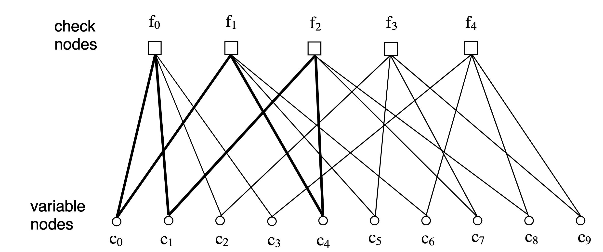

# {{ page.title }}

This page describes various representations of LDPC codes
{: .fs-6 .fw-300 }

---
## Matrix Representation
### Generator and parity check based representation
As with all linear codes, every codeword $c\in C$ of an $(n,k)$ code belongs to a $k$ dimensional linear subspace of 
$F^n$. As such, a base for the subspace may be found, and every codeword may be expressed using a generator matrix via: 
$c=uG$, where $u\in F^k$ is some vector holding information, and $G$ is a matrix whose rows are the base of the 
subspace. 

The $(n-k)$ dimensional null space of $G$, whose vectors adhere to $xG=0$, also has a base. The 
rows of the parity check matrix $H$, are made of these base vectors (the choice isn't unique). In turn, each row of the
$(n-k)$ rows of $H$ defines a specific parity check equation as for every legitimate codeword $c\in C$, we have 
$Hc^T=0$, which is yet another way to express the set of all codewords.

### Weights
A low density parity check code is defined via a sparse matrix $H$. For a *regular* LDPC code the weight (number of 
nonzero values) of each column is the same and equal to some $w_c$, while the weight of each row is
$w_r= w_c\left(\frac{n}{m}\right)$. Typically, $H$ is of full rank which implies $n-k=m$, in which case the rate of the
code depends on the wights via $R=\frac{k}{n}=1-\frac{w_c}{w_r}$.

---
## Graph Representation
### Tanner Graph
The following discussion regards only codes over binary alphabets. For such codes the parity check matrix can be 
expressed using a bipartite graph called a Tanner graph (after Tanner who invented them). The two families of nodes are
called *variable nodes* (denoted in below graph as $c_i$)  and *check nodes* (denoted in below graph as $f_i$). 
For an $(n,k)$ code there are $m=n-k$ check nodes (one per parity check equation), and $n$ variable nodes (one per 
information bit in codeword). The parity check matrix $H$ dictates the graph via the following rule: check node $j$ is 
connected to variable node $i$ when $h_{ji}=1$. As an example the $(10,5)$ code specified by:

$$
H = \begin{bmatrix}
1 & 1 & 1 & 1 & 0 & 0 & 0 & 0 & 0 & 0 \\
1 & 0 & 0 & 0 & 1 & 1 & 1 & 0 & 0 & 0 \\
0 & 1 & 0 & 0 & 1 & 0 & 0 & 1 & 1 & 0 \\
0 & 0 & 1 & 0 & 0 & 1 & 0 & 1 & 0 & 1 \\
0 & 0 & 0 & 1 & 0 & 0 & 1 & 0 & 1 & 1 \\
\end{bmatrix}.
$$

Per the rule the matrix corresponds to the graph:


|  |
|:--:|
| Image taken from [{{ bib_author[0].name }}]({{bib_author[0].url}})|

For instance, $f_0$ is connected to $c_0,c_1,c_2,c_3$ as implied by the first row of $H$. Since this code is regular, 
every variable node has 2 edges, and each check node 4 edges. A Tanner graph is characterized by a *cycle* and a 
*girth*. A cycle of length $\nu$ in a Tanner graph is a closed path of $\nu$ edges. In the example graph shown above, 
the bold edges exhibit a cycle of 6 edges. A girth $\gamma$ of a Tanner graph is the minimal cycle length in the graph.
Short cycles degrade the decoding performance of an LDPC decoder.
